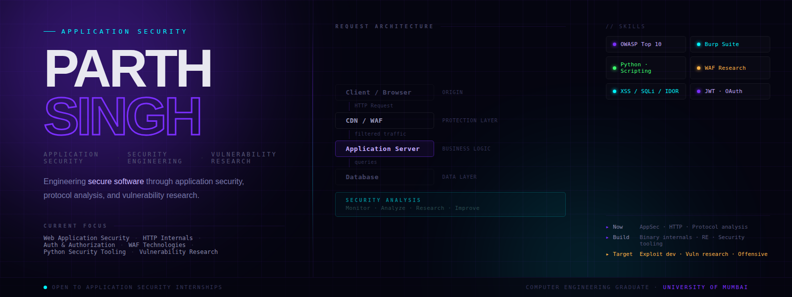

<p align="center">
  
</p>

# Parth Singh
### Application Security • Security Engineering • Vulnerability Research

Computer Engineering graduate building production-quality security tools and research-driven projects focused on web application security, secure software engineering, and vulnerability analysis.

I enjoy understanding how applications, protocols, and defensive technologies work beneath the surface—not only identifying vulnerabilities, but studying their root causes, security implications, and practical mitigations through hands-on engineering.

## 🎯 Current Focus

* Web Application Security
* OWASP Top 10
* HTTP & Web Protocols
* Python Security Tooling
* WAF Fingerprinting & Analysis
* Vulnerability Analysis

## 🧠 Research Philosophy

I believe understanding **why** a vulnerability exists is more valuable than simply reproducing it.

My approach is rooted in understanding how applications, protocols, authentication mechanisms, and defensive technologies behave before attempting to identify or exploit weaknesses.

Rather than collecting tools or payloads, I focus on building security tooling, documenting research, and developing practical engineering skills that contribute to secure software and responsible vulnerability analysis.

## 🚀 Long-Term Goal

To grow into a Vulnerability Researcher and Exploit Developer by building a strong foundation in application security, systems internals, offensive security research, and secure software engineering.
## ⚙️ Technical Focus

### 🔐 Application Security

OWASP Top 10 • Authentication & Authorization • Session Management • Secure Coding • Vulnerability Analysis

### 🌐 Web Security

HTTP/HTTPS • REST APIs • Cookies • CORS • Web Security Testing

### 🛠 Security Engineering

Python • Burp Suite • OWASP ZAP • Wireshark • Git • Linux • Docker

### 🔬 Research Interests

WAF Fingerprinting • XSS Research • Protocol Analysis • Threat Modeling • Vulnerability Reporting

<p align="left">
  
</p>
## 📚 Current Learning Journey

```text
Application Security          ████████░░  Building
HTTP & Web Protocols          ███████░░░  Building
Python Security Tooling       ███████░░░  Building
Cloud Security                ████░░░░░░  Learning
Browser Internals             ███░░░░░░░  Learning
Reverse Engineering           ██░░░░░░░░  Exploring
Exploit Development           █░░░░░░░░░  Long-Term Goal
```
This roadmap reflects the areas I'm actively studying and building through hands-on projects, technical research, and continuous experimentation
## 🤝 Connect

I'm always open to discussions about Application Security, Security Engineering, Vulnerability Research, and internship opportunities.

<p align="left">
  <a href="https://www.linkedin.com/in/https://www.linkedin.com/in/parth-singh-6342a23a4//" target="_blank">
    
  </a>

  <a href="https://instagram.com/https://www.instagram.com/parthhhsinghh?igsh=MWsyYTQ4NWdveHMxcw%3D%3D&utm_source=qr" target="_blank">
    
  </a>

  <a href="mailto:singhparth866@gmail.com">
    
  </a>
</p>

